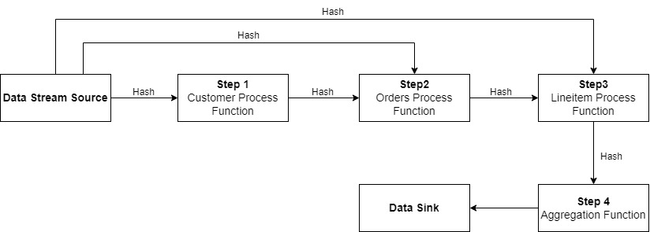

# Flink_Query_Optimizer
This project is an independent project on 2024 fall term in HKUST, supervised by Prof. Ke Yi.
It is about complex SQL statement's execution in Apache Flink, on the level of data stream instead of Flink SQL.

---

## Environment

|   Host Machine   |    Virtual Machine    |         Softwares         |
|:----------------:|:---------------------:|:-------------------------:|
|    Windows 10    |      Ubuntu 22.04     |     Flink Scala_2.12      |
| Intel i7-11800Hz | Two 2-Core Processors |       Docker 27.3.1       |
|        16G       |           8G          | Java 11, <br/>Maven 3.8.8 |

- Apache Flink and Docker are set up on Ubuntu virtual machine. Docker Compose is used to simulate the cluster in standalone mode.
- Docker Compose is based on **docker-compose.yml** file, which is also available in this project.
- Image assigned in docker-compose.yml is pulled from [Docker Hub](https://hub.docker.com/_/flink), which is authorised.
- Using Intellij IDEA 2024.1 as IDE.

---

## Data, Relation and Query

This experiment use [TPC-H](https://www.tpc.org/tpch/) decision support benchmark as testing dataset. 1GB data are generated by the following command.

```bash
./dbgen -s 1
```

This project is specially designed for Query 3 in TPC-H. Query and related relations are:

```sql
select l_orderkey,
       sum(l_extendedprice * (1 - l_discount)) as revenue,
       o_orderdate,
       o_shippriority
from customer, orders, lineitem
where c_mktsegment = 'BUILDING'
      and c_custkey = o_custkey
      and l_orderkey = o_orderkey
      and o_orderdate < '1995-03-15'
      and l_shipdate > '1993-03-15'
group by l_orderkey, o_orderdate, o_shippriority
order by revenue desc, o_orderdate;
```
- RELATION Lineitem (<u>l_orderkey, l_linenumber</u>, l_discount, l_shipdate)

  foreign key(l_orderkey) reference Orders(o_orderkey)


- RELATION Customer (<u>c_custkey</u>, c_mktsegment)


- RELATION Orders (<u>o_orderkey</u>, o_custkey, o_orderdate, o_shippriority)

  foreign key(o_custkey) reference Customer(c_custkey)

---
## Algorithm

Query Plan:



For algorithm and theory, see https://cse.hkust.edu.hk/~yike/Cquirrel.pdf.

Full paper: https://cse.hkust.edu.hk/~yike/sigmod20.pdf.